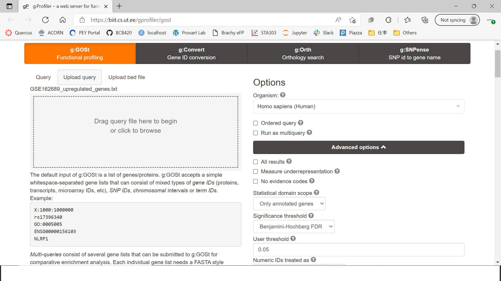

# Introduction

The **goal** of this assignment is to rank the genes in a normalized RNASeq data set by its differential expression. Then, using the ranked list of genes, we conduct a threshold-ed over-representation analysis to find over/under expression of genes.

## Data Description

In this report, we will be analyzing the data from "*A histological and transcriptional characterization of the pancreatic acinar tissue in type 1 diabetes*". In this publication, the transcriptome analysis was conducted to explore the difference in gene transcription in human pancreatic tissues of various age. 

Control were pancreatic tissues of 8 non-diabetes patients, and test conditions were the pancreatic tissues of 7 type I diabetes patients. The researchers investigated the trascriptomes of pancreas ( specifically near the "Islets of Langrhans", where Insulin hormone is created) to understand why increased age generally results in insulin impairment.

#### SetUp workspace

```{r SetUp, warning=FALSE, message=FALSE}
# Install Packages
if (! requireNamespace("ComplexHeatmap", quietly = TRUE)) {
  install.packages("ComplexHeatmap")
}
if (! requireNamespace("circlize", quietly = TRUE)) {
  install.packages("circlize")
}
if (! requireNamespace("limma", quietly = TRUE)) {
  install.packages("limma")
}
if (! requireNamespace("edgeR", quietly = TRUE)) {
  install.packages("edgeR")
}
if (! requireNamespace("ggplot2", quietly = TRUE)) {
  install.packages("ggplot2")
}
if (! requireNamespace("dplyr", quietly = TRUE)) {
  install.packages("dplyr")
}
if (! requireNamespace("stringr", quietly = TRUE)) {
  install.packages("stringr")
}
# Load Packages
library(ComplexHeatmap)
library(circlize)
library(limma)
library(edgeR)
library(stringr)
library(dplyr)
library(ggplot2)
```

#### Load Data from A1

```{r Load A1 Data, message=FALSE, warning=FALSE}

normalized_counts <- read.table(file=file.path(getwd(),  
                                               "GSE162689_normalized_counts.txt"),
                                header = TRUE, sep = "\t", 
                                stringsAsFactors = FALSE, 
                                check.names = FALSE)

```

## Variable Description

In the data, there were originally 60 variables: *is_133_001, is_133_002, ... , is_133_060* where the last 2 digits kept incrementing until 60. Each of these columns contain the counts recorded from trascriptome analysis on human pancreatic tissues.

For $i$ th patient, 

```{r, warning=FALSE, message=FALSE, echo=FALSE}

label <- c("Arbitrary variable name", "examples", "what they represent")
col1 <- c("is_133_0[1 + 4(i-1)]", "is_133_0[2 + 4(i-1)]", "is_133_0[1 + 3(i-1)]", "is_133_0[4 + 4(i-1)]")
col2 <- c("is_133_01, is_133_05, is_133_09 etc.", "is_133_02, is_133_06, is_133_010 etc.", "is_133_03, is_133_07, is_133_011 etc.", "is_133_04, is_133_08, is_133_012 etc.")
col3 <- c("Islet tissue", "Exocrine tissue adjacent to islets (within 50 um from islets)", "Exocrine tissue at a distance between 50-100 um from islets", "Exocrine tissue far from islets (a minimum of 100 um from islets)"
)

kableExtra::kable(cbind(col1, col2, col3), format = "html", col.names = label)
```

### Control vs. Treatment

The samples *is_133_001* to *is_133_032* are data extracted from pancreas tissues of **non-diabetic** patients. (each patient will have 4 samples associated) There are 8 non-diabetic patients in total.

The samples *is_133_032* to *is_133_060* are data extracted from pancreas tissues of **type I diabetic** patients. (each patient will have 4 samples associated). There are 7 type I diabete patients in total.

## Creating MDS Plot

```{r MDS Plot, message=FALSE, warning=FALSE}

# Create heatmap matrix
heat_matrix <- as.matrix(normalized_counts)
heat_matrix <- t(scale(t(heat_matrix)))  # Scale the heatmap

# Create MDS Plot
limma::plotMDS(heat_matrix, label = colnames(heat_matrix),
               col = rep(c("blue", "turquoise"), 10)
               )
```


# Differential Gene Expression

Here we conduct differential expression analysis.

```{r Differential Gene Expression, message=FALSE, warning=FALSE}

# Here we attempt to get rid of "iss_133_0" part of the label=============

# Check if all variables in normalized_counts data follows format "iss_133_0XX"

sum <- 0

for (i in 1:ncol(normalized_counts)){
  sum = sum + grepl(pattern = "is_133_0", x = colnames(normalized_counts)[i], ignore.case = F)
}

# Check the numbers
sum == ncol(normalized_counts)  
# Returned TRUE, hence all column names are in format of "is_133_0XX"

# Initialize vector containing new label
new_label <- c()

# Now, we change the label 
for (i in 1:ncol(normalized_counts)){
  new_label[i] <- gsub(pattern = "is_133_0", 
                       x = colnames(normalized_counts)[i], 
                       replacement = "")
}

# Fitting data to model=================
# Get model
patients <- c()
patient_type <- c()

for (i in 1:length(new_label)){
  id <- as.integer(new_label[i])
  patients[i] <- LETTERS[((id-1)%/%4)+1]
  
  # If id is at or below 32, it is non-diabetic (0), otherwise diabetic(1)
  if (id <= 32){
    patient_type[i] <- "1"  # non-diabete
  } else{
    patient_type[i] <- "2"  # diabete
  }
}

samples <- data.frame(cbind(colnames(normalized_counts), patients, patient_type))
colnames(samples) <- c("variable_name", "patients", "patient_type")
rownames(samples) <- colnames(normalized_counts)

# Get model here

model_design <- model.matrix(~ samples$patient_type)

# Get data
exp_matrix <- as.matrix(normalized_counts)
colnames(exp_matrix) <- new_label
rownames(exp_matrix) <- rownames(normalized_counts)

min_set <- Biobase::ExpressionSet(assayData = exp_matrix)

# Fit data into the model
fit <- lmFit(min_set, model_design)

# Apply Bayes method to calculate differential expression
fit_bayes <- limma::eBayes(fit, trend = T)

topfit <- topTable(fit_bayes, 
                   coef = ncol(model_design),
                   adjust.method = "BH",  #Benjamin hochberg
                   number = nrow(exp_matrix))

hit_results <- merge(normalized_counts, 
                     topfit, by.y = 0, by.x = 0,
                     all.y = T)

# Arrange results by the p-values
hit_results <- hit_results[order(hit_results$P.Value),]
```

## p-value Calculation

Under this section, we present the result of the previous chunk of code (where we fit our data to the model to figure the p-value before correction). We will also discuss the choice of threshold and the result of calculation. 

### Threshold Choice? - Avoiding p-hacking

We set the threshold for p-value to be 0.05, meaning that genes are only significantly differentially expressed if p-value 0.05. This is because 0.05 is the conventional threshold set in statistical field, and by choosing a traditionally used threshold value, we can prevent manipulation of analysis results such as p-hacking. 

**NOTE** 
p-hacking is an example of unethical statistical practice of  changing the threshold to yield desired statistical conclusion. (ex. setting higher threshold would result in more data points considered to be "significantly expressed" as there will be more p-values rejected.)

```{r Present the data sorted by p-values}

# Check the statistics for the first 10 genes 
# (Please note: the genes are arranged by p-value)
knitr::kable(hit_results[1:10,c(1,61:66)],
             type = "html",
             row.names = F)

# How many genes pass threshold?
length(which(hit_results$P.Value < 0.05))

# How many genes pass correction? (ie. their adjusted p-value is below threshold)
length(which(hit_results$adj.P.Val < 0.05))

# How many genes are there in total?
nrow(hit_results)
```

### How many genes were significantly differentially expressed? 

We see that 3852 genes out of 14809 genes are significantly differentially expressed (ie. p-value is below the threshold of 0.05).

### Multiple Hypothesis p-value Correction

The Benjamin Hochberg p-value correction method was applied, as this correction method is one of the most popular p-value correction method in the bioinformatics field. Then we get the adjusted p-value (variable: adj.P.Val). 

Then, 1470 genes passed the correction.

```{r}
# How many genes pass correction? (ie. their adjusted p-value is below threshold)
length(which(hit_results$adj.P.Val < 0.05))
```


## MA / Volcano Plot

```{r Volcano Plot: logFC vs -log10(p-val)}

# Create data for volcano plot
volcano_data <- hit_results[,c(61, 64, 65)]
rownames(volcano_data) <- hit_results[,1]

volcano_data <- volcano_data %>% 
  mutate(diff_exp = case_when((adj.P.Val < 0.05 & logFC > 0) ~ "Pos",
                              (adj.P.Val < 0.05 & logFC < 0) ~ "Neg",
                              (adj.P.Val >= 0.05 | (adj.P.Val < 0.05 & (logFC == 0))) ~ "No"))

volcano_data <- volcano_data %>% 
  mutate(neg_log10p = -log10(volcano_data$adj.P.Val))

volcano_data %>% ggplot(aes(x=logFC, y=neg_log10p, label = rownames(volcano_data), col = diff_exp)) + 
  geom_point() + 
  scale_color_manual(values= c("Pos" = "dark red", 
                               "Neg" = "dark blue",
                               "No" = "grey") ) +
  geom_hline(yintercept = -log10(0.05), col = "red") +
  theme_minimal() +
  geom_text() + 
  labs(title = "Volcano Plot", 
       x = "log2(fold change)",
       y = "-log10(p-value)")
```

**caption** 

Volcano plot, which is a scatter plot of log2(fold change) VS -log10(p-value). Here we color code the points and its corresponding gene symbols with red, blue, and grey. All genes that are **significantly differentially expressed and upregulated** are colored **red**. Those that are **significantly downregulated are blue**. **Otherwise**, it is coloured **grey**.


## Heatmap for Tophits

```{r Heatmap for tophits, warning=FALSE, message=FALSE}

# Gene symbols of top hit genes
tophit_genes <- hit_results[which(hit_results[,65] < 0.01), 1]

# Mutate the initial heat matrix so it only contains info for tophit genes
heat_matrix_tophits <- t(scale(t(heat_matrix[which(rownames(heat_matrix) %in% tophit_genes), ])))

# Reoder to ensure that the rows will be ordered from is_133_001 to is_133_060. (ie. the order where last 2 digits increase.)
heat_matrix_tophits <- heat_matrix_tophits[, c(grep(colnames(heat_matrix_tophits), pattern = "is_133_0([0-2][0-9]|[3][0-2])"),
                                               grep(colnames(heat_matrix_tophits), pattern = "is_133_0([4-6][0-9]|[3][3-9])"))]

# Set color scale
heat_col_tophits <- NULL

if (min(heat_matrix_tophits) >= 0){
  # Case where there are no negative values
  heat_col_tophits = colorRamp2(c(0, max(heat_matrix_tophits)),
                                c("white", "red"))
} else{
  heat_col_tophits = colorRamp2(c(min(heat_matrix_tophits), 0, max(heat_matrix_tophits)),
                                c("blue", "white", "red"))
}

# Create heat map for tophits
heatmap <- Heatmap(as.matrix(heat_matrix_tophits),
                   cluster_rows = T, cluster_columns = F,
                   show_row_dend = T, show_column_dend = F,
                   col = heat_col_tophits, 
                   show_column_names = T, show_row_names = F,
                   show_heatmap_legend = T
                   )

heatmap <- Heatmap(as.matrix(heat_matrix_tophits),
                   cluster_rows = T, cluster_columns = F,
                   show_row_dend = T, show_column_dend = F,
                   col = heat_col_tophits, 
                   show_column_names = T, show_row_names = F,
                   show_heatmap_legend = T
                   ) + labs(title = "Heatmap for tophits")
heatmap

```

**caption**

The above figure is the Heatmap we created for the top hit gene, where only the genes with p-value less than 0.01 were selected. 

Please note that I chose p-value of 0.05 when assessing how many genes were significantly expressed, but here I used the threshold of 0.01 instead for the sake of simplicity in visualization.

**Interpretation**

Here, we see that the genes in the upper area of the heat map are upregulated in non-diabetic patients (the color is red in samples is_133_001 to is_133_032) whereas the same set of genes are downregulated in diabetic patients (the color is blue in samples is_133_033 to is_133_060).  In contrast, the bottom half of the genes in the heatmap are downregulated (blue) for non-diabetic patients, and upregulated (red) for diabetic patients.

Therefore, our **conditions (non-diabetic control group VS diabetic treatment group) CLUSTER**. This difference in the significant up/down regulations in certain genes between non-diabetic control group and diabetic treatment group may suggest that the difference in these gene regulation would imply something about the diabete conditions. ie. It is probable that there is biological relevance between the diabete conditions and the gene regulations.

# Thresholded Over-Representation Analysis

First, we sort our data into significantly up/down regulated genes from the differential expression analysis that we conducted. Then, we save the files.

```{r Threshold Data Save, warning = FALSE, message=FALSE}
# Create new column: Rank
total_hits <- volcano_data %>% 
  mutate(rank = -log10(adj.P.Val) * sign(logFC))

# Order by rank
total_hits <- total_hits[order(total_hits$rank),]

# Create smaller groups of genes: upregulated vs downregulated
upreg_genes <- rownames(total_hits)[
  which(total_hits$adj.P.Val < 0.05 
             & total_hits$logFC > 0)]
downreg_genes <- rownames(total_hits)[
  which(total_hits$adj.P.Val < 0.05 
             & total_hits$logFC < 0)]

# Save data
write.table(x=upreg_genes,
            file=file.path("GSE162689_upregulated_genes.txt"),sep = "\t",
            row.names = FALSE,col.names = FALSE,quote = FALSE)
write.table(x=downreg_genes,
            file=file.path("GSE162689_downregulated_genes.txt"),sep = "\t",
            row.names = FALSE,col.names = FALSE,quote = FALSE)
write.table(x=data.frame(genename= rownames(total_hits),F_stat= total_hits$rank),
            file=file.path("GSE162689_ranked_genelist.txt"),sep = "\t",
            row.names = FALSE,col.names = FALSE,quote = FALSE)

```

## Chosen Method and Justification

We input the saved data (list of significantly up/down regulated genes) to external site for thresholded gene set enrichment analysis.

We specifically used the **GProfiler** website: [https://biit.cs.ut.ee/gprofiler/gost]

The content of the upregulated gene symbols and downregulated gene symbols were copied and pasted to the Gprofiler. Below is the screenshot of when the upregulated gene group was inputted. 




## Gprofiler results

We used the annotation data of **GO Biological process: VERSION **. Since we are interested in the production of insulin, the results would be easier to understand if we are annotating the genes by biological process, rather than cell components or other micromolecular components. Ofcourse, cell components and molecular information may be useful too, but since production of insulin is a complex biochemical metabolism that involves multiple biological pathways, we would like to know what biological processes are affecting the insulin production within human body. 

**Gprofiler VERSION: e105_eg52_p16_e84549f**

Upregulation gene: 493 out of `r length(upreg_genes)` genes showed on result


Downregulated gene: 116 out of `r length(downreg_genes)` genes showed on result


Together: 493 out of `r length(upreg_genes) + length(downreg_genes)` genes showed on result


Since the result of combined query (queried genes in upregualted and downregulated files TOGETHER) looks similar to the result of upregulated genes query, we can see that the upregulated genes have higher significance than the downregulated genes. Not to mention, this result could also be due to the face that significantly downregulated genes are involved in the same biological process where significantly upregulated genes are involved in, hence making the annotation result similar.

# Interpretation

In this section, we answer the prompts asked in the Assignment 2 instruction page.

**1) Do the over-representation results support conclusions or mechanism discussed in the original paper?**

The original paper discussed the difference in the insulin production activity in pancreas, specifically near the Isle of Langrhans where the insulin hormones are mainly produced. Overproduction of insulin could result in type I diabetes, leading to a metabolism distruption and potentially resulting in obesity. The over-representation results from Gprofiler shows that for BOTH the downregulated gene group and upregulated gene group, the significantly expressed genes are involved in a metabolic biological process, which is **highly relevant to the topic of diabetes disease in the original study**. Hence, it supports that the over-expression of the up/downregulated genes in our dataset has some involvement with the diabetes disease, specifically in the metabolism process aspect.

**2) Can you find evidence, i.e. publications, to support some of the results that you see. How does this evidence support your results.**

Yes. Selvaraju V. et al (2012) have published a scientific article that discusses the correlationship between diabetes disease and the insulin secretion. The paper states that diabetes involves impairment in the complex metabolic processes causing the cardiovascular function to decrease and destroying the balance of oxidants and anti-oxidants within a human body, at a cellular level. Based on the results of the Gprofiler, the overexpression in the various metabolic / biosynthetic processes are observed, and some of these processes are specific to certain esterfication reactions. For example, organonitrogen compound, purine deoxyribonucleotides, and 2'deoxyribonucleotides are some of the compounds going under catabolic or metabolic processes, and such biological process are relevant to our over-expression genes. Hence, we see that the significantly up/down regulated genes are significantly expressed in biological processes that are likely to be involved in the insulin production / diabetic symptoms.